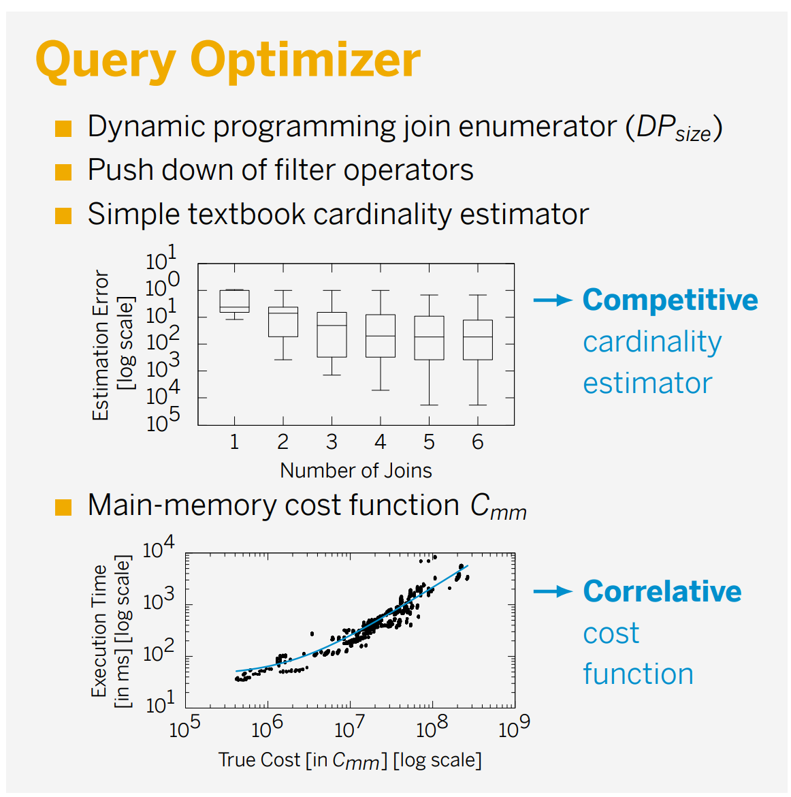
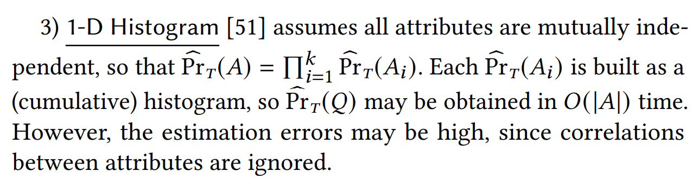
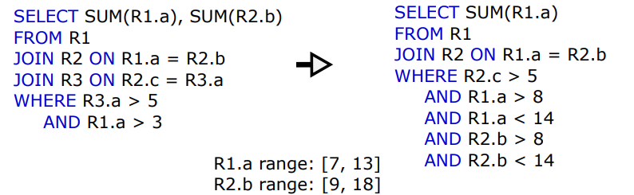

# Spring 2023, DB Final Homework

许珈铭、李昊洋

## 1 项目说明

我们已将环境与第五名的代码封装好，可以直接从docker上拉取：

```shell
docker pull lhygood11229/db_final_hw:1.0.0
```

然后，可以创建一个名为`hw`的容器，运行：

```shell
docker run -it --name hw lhygood11229/db_final_hw:1.0.0
```

所有代码均已放在`/home`文件夹下，其中有两个子文件夹：`/home/submission`文件夹用于跑workload进行测试（默认跑`workload/small`，可以更改`./runTestharness.sh`来选择要跑的workload）；`/home/flomige/`则存放了我们修改后的排行榜第五的代码。

我们也将代码的修改放到了GitHub上：[lhy101/db_final_hw: db_final_hw (github.com)](https://github.com/lhy101/db_final_hw)，也可以从上面直接拉取代码，并在自己的环境上进行测试。**即，用该repo替换**`/home/flomige`**目录即可**，注意拉取代码后要先编译（每次修改代码后，也需要再重新编译一遍）：

```shell
cd /home/flomige
./compile.sh
```

之后，在`/home/submission`文件夹下运行`./runTestharness.sh`即可。其默认跑`/home/submission/workload/small`并输出总耗时（单位ms）：

```shell
cd /home/submission
./runTestharness.sh
```

```shell
# 以下为输出
execute small ...
59
```

## 2 代码解读

### 2.1 整体流程

代码的入口位于`tests\TestsProgrammingContest.cpp`。具体来看，整个pipeline可以分为以下三个部分：

* **读取数据阶段**：从stdin读取table的数据，直到遇到输入`"Done"`为止。然后，根据table的平均行数（median table cardinality），将之后的处理分为两种情况——当行数小于等于`200000`时，认为是small workload，代码使用`partition size = 2048`的分区方式；而当行数大于`200000`时，认为是large workload，代码使用`partition size = 16384`的分区方式。

  ```c++
  // smaller workload -> partition size = 2048
  // set all parameters
  // sets the size of the bitmap of the cht, i.e., size of the bitmap = CHT_BITMAP_MULTIPLICATOR getTupleCount()
  query_processor::CHT_BITMAP_MULTIPLICATOR = 32;
  // sets the number of partitions, i.e., number of partitions  = 2 ^ CHT_PARTITION_COUNT_BITS
  query_processor::CHT_PARTITION_COUNT_BITS = 4;
  // sets the number of partitions for CAT
  query_processor::CAT_PARTITION_COUNT = 40;
  // threshold to use CAT by the density of the keys, i.e., range / cardinality
  query_processor::CAT_DENSE_THRESHOLD = 100;
  // threshold to enable the CAT_DENSE_THRESHOLD, i.e., for a small range use CAT, since we have no overhead for hashing
  query_processor::CAT_ENABLE_DENSE_THRESHOLD = 100000;
  ```

* **数据预处理阶段**：在此阶段中，代码将所有table建立。同时，为了之后查询优化的部分，其提前计算好table中每一列的**最大值**与**最小值**，以及**不重复的元素个数**。

  ```c++
  // create database
  database::Database<2048> database("DB");
  
  // create all tables
  TableCreator<2048> tableCreator;
  for (uint32_t t = 0; t < tableIds.size(); ++t) {
      tableCreator.addTableCreatorTask(database, tableLoader._tableIds[t], tableLoader._mmapPointers[t],
          tableLoader._cardinalities[t], tableLoader._columns[t]);
  }
  tableCreator.createTables();
  ```

  ```c++
  // calculate min and max
  statisticsBuilder.calculateMinAndMax(database, true);
  
  // detect distinct columns
  statisticsBuilder.calculateDistinct(database, false);
  ```
  
* **SQL查询阶段**：通过profile我们可以发现，上述两个阶段均在`1s`内完成，很好地利用了题设中`1s`的间隔，来对数据做提前地处理。之后，在SQL查询阶段，其逐行读取query，并最终执行。

  ```c++
  // read queries
  QueryRunner<2048, query_processor::AdaptiveQueryExecutor<2048>> queryRunner;
  while (std::getline(std::cin, line)) {
      // end of a batch
      if (line == "F") {
          queryRunner.finishBatch();
          continue;
      }
      // add query task to the query runner
      queryRunner.addQuery(database, line);
  }
  ```
### 2.2 多线程

由于该任务提供的机器是NUMA结构，为了充分利用机器上多核CPU的性能，代码采用了多线程的方式，通过pthread接口，在每个NUMA node上创建一个线程，来独立地进行处理。

 ```c++
 // 多线程结构
 
 void TaskScheduler::initialize(){
     // under the assumption that the numa configuration does not change during the process runtime, e.g. we run in a VM
 
     // ensure that we initialize only once
     std::unique_lock<std::mutex> uLock(_initializationMutex);
     if(!_initialized){
         // basically create as much threads on a node as we have configured on that node. bind them to the node, not to a specific cpu which
         // allows them to be reschduled inside the node
 
         // run over all numa nodes
         for(uint32_t numaNode=0; numaNode < basis::NUMA_NODE_COUNT; numaNode++){
 
             // for each cpu on a socket
             for(uint32_t cpu=0; cpu<basis::CORES_PER_NUMA; cpu++){
                 // get new a worker id
                 uint32_t workerId = _threads.size();
                 // emplace a thread handle
                 _workersNumaNode.push_back(numaNode);
                 // create the worker thread parameters
                 Worker::WorkerThreadParameters* param = new Worker::WorkerThreadParameters(numaNode, workerId, _taskQueues);
                 // finally create the worker thread
                 _threads.emplace_back();
                 pthread_create(&_threads[cpu], NULL, Worker::run, param);
                 //_threads.emplace_back(Worker::run, param);
             }
 
         }
         _initialized=true;
     }
 }
 ```

原代码在每个线程上都维护了一个queue，尽管其实现方式是定义了一个全局的`TaskQueues TaskScheduler::_taskQueues`。如下所示，为了保证对queue访问的一致性，其在`class TaskQueues`中使用了`std::mutex`锁。

```c++
class TaskQueues {

    public:
        static const uint32_t PARTITIONS_PER_NUMA = 16;

    private:
        std::array<std::array<std::mutex, PARTITIONS_PER_NUMA>, NUMA_NODE_COUNT> _queueMutexes;
        std::array<std::array<std::queue<std::shared_ptr<TaskBase>>, PARTITIONS_PER_NUMA>, NUMA_NODE_COUNT> _queues;

    public:

        TaskQueues();

        void push(std::shared_ptr<TaskBase> task);

        std::shared_ptr<TaskBase> getTask(uint32_t numaNode);

};
```

代码运行期间，不断的会有task进入该queue，而代码采用了一个带优先级的用户态的scheduler来对这些task进行调度。此处，比较有趣的是，queue中的task不只有最终运行一系列查询（query）时的任务，其还包含了数据预处理（preprocess）时的任务——即在开头`1s`的数据预处理中，其也充分地利用了NUMA多线程的性质。

```c++
// 用户态实现的线程调度

enum TaskState : char {
    TASK_WAITING_FOR_EXECUTION,
    TASK_IN_EXECUTION,
    TASK_EXECUTED,
    TASK_FAILED,
    TASK_ABORTED
};

enum TaskGroupState {
    TASK_GROUP_WAITING_FOR_EXECUTION,
    TASK_GROUP_IN_EXECUTION,
};

enum TaskPriority {
    HIGH_TASK_PRIO=0,
    MEDIUM_TASK_PRIO=1,
    OLAP_TASK_PRIO=2,
};
```

而scheduler的核心，实际上就是不断地在loop中运行task。其利用C++的多态性质，在统一的loop中调用不同task的`execute()`函数，以执行不同的任务。

```c++
// run over all tasks
for(std::shared_ptr<TaskBase>& task : _taskGroup._groupTasks){
	...
    try{
        task->execute();
        task->setExecuted();
    }
    catch(std::exception& e){
        task->setFailed(e);
    }
    ...
}
```

### 2.3 预处理任务

这一部分由计算table中每一列的**最大值**与**最小值**，以及**不重复的元素个数**这两个小部分构成。


以计算最大值与最小值为例，我们可以看到，其也使用了上面提到的scheduler来进行加速。具体来讲，其将**计算每一列的最大最小值**作为一个task，因此，对于一个table，其会有`#column`个task在并行计算——这无疑大大提升了计算效率。

```c++
// numa distributer
uint64_t numaDistributionCounter = 0;
// get the tables from the database
std::vector<database::Table<TABLE_PARTITION_SIZE>*> tables;
database.getTables(tables);
// iterate over all tables
for (database::Table<TABLE_PARTITION_SIZE>* table : tables) {
    // get the permanent columns
    std::vector<database::PermanentColumn<TABLE_PARTITION_SIZE>*> permanentColumns;
    table->getColumns(permanentColumns);
    // create a min and max calculation task for each column
    for (database::PermanentColumn<TABLE_PARTITION_SIZE>* column : permanentColumns) {
        // create stats builder task
        std::shared_ptr<basis::TaskBase> task(new(numaDistributionCounter++%basis::NUMA_NODE_COUNT) MinAndMaxCalculationTask(column));
        // submit it to the task scheduler
        basis::TaskScheduler::submitTask(task);
        // add the task to the task group
        _tasks.push_back(task);
    }
}
```

具体到`MinAndMaxCalculationTask`这一task的构成，其核心需要实现的`execute()`函数的逻辑是十分简单的：即通过遍历table某一列的所有行，来找到该列最大的元素与最小的元素。

```c++
void execute() {
    uint64_t minValue = std::numeric_limits<uint64_t>::max() - 1; 
    uint64_t maxValue = std::numeric_limits<uint64_t>::min();
    uint64_t* currentValue = reinterpret_cast<uint64_t*>(_permanentColumn->getAddr());
    for (uint32_t i = 0; i < _permanentColumn->getLatestCardinality(); ++i) {
        if (currentValue[i] < minValue) {
            minValue = currentValue[i];
        }
        if (currentValue[i] > maxValue) {
            maxValue = currentValue[i];
        }
    }
    _permanentColumn->setMinValue(minValue);
    _permanentColumn->setMaxValue(maxValue);
}
```

而计算不重复元素的`DistinctCalculationTask`与之十分类似，这里就不再赘述了。

### 2.4 查询任务

对于查询任务，其将一组到输入`"F"`之前的query视作一个batch，而每行query则构成这一个batch中的独立的task。该task的优先级为`OLAP_TASK_PRIO`，同样地，task会被push到scheduler中，且只有所有task执行完后，其才会进行后续的输出。

```c++
// submit tasks to the task scheduler
for (std::shared_ptr<basis::TaskBase>& task : _tasks.back()) {
    basis::TaskScheduler::submitTask(task);
}
// wait until all query tasks have been finished
bool allTasksAreFinished = false;
while (!allTasksAreFinished) {
    allTasksAreFinished = true;
    for (std::shared_ptr<basis::TaskBase>& task : _tasks.back()) {
        if (!task->isAlreadyFinished()) {
            allTasksAreFinished = false;
        }
    }
    // sleep a while if not all tasks have been loaded
    if (allTasksAreFinished) {
        std::this_thread::sleep_for(std::chrono::microseconds(500));
    }
}
```

具体到每一个task该如何`execute()`，则是整个代码工程量最大的地方。其首先会对task做统一的parse，即，将用户输入的raw string转化成特定的`QueryInfo`类，其中存储了该条查询join的条件以及projection的条件。

```c++
class QueryInfo {
    ...
    private:
        std::vector<query_processor::TableInput> _tables;
        std::vector<query_processor::JoinAttributeInput> _innerEquiJoins;
        std::vector<query_processor::ProjectionMetaData> _projections;
	...
}

// parse query
QueryInfo queryInfo(_rawQuery);
```

之后，将转化好的查询放入optimizer中进行查询优化。

```c++
// optimize and execute the query
Executor executor;
std::shared_ptr<query_processor::ProjectionBreaker<TABLE_PARTITION_SIZE>> resultBreaker
     = std::static_pointer_cast<query_processor::ProjectionBreaker<TABLE_PARTITION_SIZE>>(executor.execute(
        _database, queryInfo.getTables(), queryInfo.getInnerEquiJoins(), queryInfo.getProjections()));
```

在optimizer中，其采用了传统的cardinality estimation & cost model的方法，来得到最优的plan。同时，其也采用了一些heuristic的设计，通过检测各种statics，进行re-optimization，来得到更优的plan。



最终，按照给出的plan，执行各operator即可。

## 3 代码修改

### 3.1 基数估计

我们首先修改了`/home/flomige/src/query_processor/QueryOpitimizer.h`文件的基数估计部分。其中，具体修改了`estimateJoinSelectivity`与`estimateFilterCardinality`这两个函数，前者是估计join操作（例如，`stu.id = ta.id`）的基数，后者则是估计filter操作（例如，`ta.salary > 3000`）的基数。

#### 3.1.1 基于filter操作的基数估计

以较为简单的`estimateFilterCardinality`为例，原代码的做法是在preprocess阶段得到每一列的min和max的value，以及非空元素的个数，然后简单地认为其符合均匀分布。于是，对于filter是`=`的情况，其直接将非空元素的个数除以`max - min`作为最终的基数估计。而对于filter是`<`或者`>`的情况，其将非空元素的个数乘以filter后的区间所占总的`max - min` 的区间的比例作为最终的基数估计。

```c++
// returns the estimated filter cardinality according to the min value, max value, not null count and cardinality of the column
static uint64_t estimateFilterCardinality(
    uint64_t min,
    uint64_t max,
    uint64_t cardinality, // notNullCount
    FilterMetaData::Comparison filterPredicate,
    uint64_t constant
){
    // if the constant is not in the active domain, then this filter will eliminate all values
    if (constant < min || constant > max) {
        return 0;
    }
    // calculate the cardinality of the active domain
    double activeDomain = static_cast<double>(max - min + 1);
    // estimated cardinality for one value
    double oneValueCount = static_cast<double>(cardinality) / activeDomain;
    // return the estimated cardinality after the filter predicate
    switch (filterPredicate) {
        case FilterMetaData::Comparison::Less : {
            // number of values < constant, i.e., [min, constant): constant - min
            return static_cast<double>(constant - min)  * oneValueCount;
        };
        case FilterMetaData::Comparison::Equal : {
            return oneValueCount;
        };
        case FilterMetaData::Comparison::Greater : {
            // number of values > constant, i.e., (constant, max]: max - constant
            return static_cast<double>(max - constant) * oneValueCount;
        };
        default : throw std::runtime_error("This filter predicate is not supported.");
    }
}
```

然而，这种基数估计的方法过于naive。考虑到我们之前阅读的论文**FLAT: Fast, Lightweight and Accurate Method for Cardinality Estimation**（paper地址：[arxiv.org/pdf/2011.09022.pdf](https://arxiv.org/pdf/2011.09022.pdf)），其恰好和基数估计相关，因此此处，我们采用了该论文中related work里提到的**1-D Histogram**基数估计的方法。

选用该方法的原因是其实现起来较为简单，且能很好地在原先的code base上进行修改与适配。



具体来讲，我们为table的每一列存储一个histogram。

```c++
template<uint32_t TABLE_PARTITION_SIZE>
class PermanentColumn : public RawColumn<TABLE_PARTITION_SIZE> {
    ...
    uint64_t* histogram = NULL;

    PermanentColumn(...){
		...
        // initialize the histogram
        histogram = (uint64_t*)calloc(slice_num, sizeof(uint64_t));
    }

    ~PermanentColumn(){
        free(histogram);
        histogram = NULL;
    }
    ...   
}
```

例如，假设某一列共有`20`个record，其中的最小值是`0`，最大值是`15`，我们可以将其平均分为了`5`个区间`[0,3)`、`[3,6)`、`[6,9)`、`[9,12)`、`[12,15)`。这些区间分别记录了处于各自区间范围内的`#records`。而在每个区间内部，我们认为record的分布是均匀的。因此，原先的`estimateFilterCardinality`就可以修改为下面这样：

```c++
// returns the estimated filter cardinality according to the min value, max value, not null count and cardinality of the column
static uint64_t estimateFilterCardinality(
    uint64_t min,
    uint64_t max,
    uint64_t* histogram,
    uint64_t cardinality, // notNullCount
    FilterMetaData::Comparison filterPredicate,
    uint64_t constant
){
    // if the constant is not in the active domain, then this filter will eliminate all values
    if (constant < min || constant > max) {
        return 0;
    }
    uint64_t slice_size = (max - min + 1) / database::slice_num;
    uint64_t cur_slice_num = database::slice_num;
    while(slice_size == 0)
    {
        cur_slice_num /= 2;
        slice_size = (max - min + 1) / cur_slice_num;
    }
    uint64_t slice_idx = (constant - min) / slice_size;
    if(slice_idx >= cur_slice_num)
        slice_idx = cur_slice_num - 1;
    uint64_t lower_bound = min + slice_idx * slice_size;
    uint64_t upper_bound = slice_idx == cur_slice_num - 1 ? max : (slice_idx + 1) * slice_size;
    slice_size = upper_bound - lower_bound;
    switch (filterPredicate) {
        case FilterMetaData::Comparison::Less : {
            // number of values < constant, i.e., [min, constant): constant - min
            double sum = 0;
            for (uint64_t i = 0; i < slice_idx; i++)
                sum += histogram[i];
            sum += static_cast<double>(constant - lower_bound) / slice_size * histogram[slice_idx];
            return sum;
        };
        case FilterMetaData::Comparison::Equal : {
            return static_cast<double>(histogram[slice_idx]) / slice_size;
        };
        case FilterMetaData::Comparison::Greater : {
            // number of values > constant, i.e., (constant, max]: max - constant
            double sum = 0;
            for (uint64_t i = slice_idx + 1; i < cur_slice_num; i++)
                sum += histogram[i];
            sum += static_cast<double>(upper_bound - constant - 1) / slice_size * histogram[slice_idx];
            return sum;
        };
        default : throw std::runtime_error("This filter predicate is not supported.");
    }
}
```

而对于histogram的计算，我们将其放在preprocess阶段，这样可以用`1s`的时间间隔将其overlap掉，而不必占用后续query的时间。

```c++
// 直接plugin到calculateDistinct的task中进行overlap（不需要单独创建task去计算）

void execute() {
    uint64_t minValue = _permanentColumn->getLatestMinValue();
    uint64_t maxValue = _permanentColumn->getLatestMaxValue();
    uint64_t slice_size = (maxValue - minValue + 1) / database::slice_num;
    uint64_t cur_slice_num = database::slice_num;
    while(slice_size == 0)
    {
        cur_slice_num /= 2;
        slice_size = (maxValue - minValue + 1) / cur_slice_num;
    }
    bool result = true;
    std::vector<bool> bitset(maxValue - minValue + 1, false);
    uint64_t* currentValue = reinterpret_cast<uint64_t*>(_permanentColumn->getAddr());
    for (uint32_t i = 0; i < _permanentColumn->getLatestCardinality(); ++i) {
        if (bitset[currentValue[i] - minValue]) {
            // duplicate found, i.e., column is not distinct
            _permanentColumn->setDistinct(false);
            result = false;
        }
        bitset[currentValue[i] - minValue] = true;
        // set the histogram
        uint64_t slice_idx = (currentValue[i] - minValue) / slice_size;
        if(slice_idx >= cur_slice_num)
            slice_idx = cur_slice_num - 1;
        _permanentColumn->histogram[slice_idx]++;
        // std::cout << _permanentColumn->histogram[slice_idx] << std::endl;
    }
    // all values are checked and no duplicate found, i.e., column is distinct
    if (result)
        _permanentColumn->setDistinct(true);
}
```

#### 3.1.2 基于join操作的基数估计

相应的，对于join操作，我们也可以使用**1-D Histogram**方法进行基数估计（即，认为要join的两列相互独立，即`P(AB) = P(A) * P(B)`），具体方法详见修改后的代码：

```c++
 // returns the estimated join selectivity according to the min value, max value and cardinality of the left and right relation
static double estimateJoinSelectivity(
    uint64_t leftMin,
    uint64_t leftMax,
    uint64_t leftNotNullCount,
    uint64_t leftCardinality,
    uint64_t* leftHistogram,
    uint64_t rightMin,
    uint64_t rightMax,
    uint64_t rightNotNullCount,
    uint64_t rightCardinality,
    uint64_t* rightHistogram
){
    // ideas from query compiler by moerkotte: beginning at page 427 with section 24.3 'a first logical profile and its propagation'

    // check if active domains are exclusive
    if(leftMax < rightMin || rightMax < leftMin){
        // if the active domains are exclusive, then the join selectivity is zero
        return 0;
    }
    // temp store the maximal join cardinality aka the cross product
    uint64_t maxJoinCardinality = leftCardinality * rightCardinality;
    // determine the join range
    // the minimum in the join range is the maximum of the left and right min
    uint64_t joinMin = std::max(leftMin, rightMin);
    // the maximum in the join range is the minimum of the left and right max
    uint64_t joinMax = std::min(leftMax, rightMax);
    // apply selection with range query predicate
    // if the left relation [leftMin, leftMax] is not completely included in the join range [joinMin, joinMax],
    // then reduce the cardinality of the left relation relatively to the join range by assuming uniform distribution
    if (joinMin != leftMin || joinMax != leftMax) {
        double lowerHistogram = estimateFilterCardinality(leftMin, leftMax, leftHistogram, leftNotNullCount, FilterMetaData::Comparison::Greater, joinMin - 1);
        double upperHistogram = estimateFilterCardinality(leftMin, leftMax, leftHistogram, leftNotNullCount, FilterMetaData::Comparison::Greater, joinMax + 1);
        leftNotNullCount = lowerHistogram - upperHistogram;
    }
    // if the right relation [rightMin, rightMax] is not completely included in the join range [joinMin, joinMax],
    // then reduce the cardinality of the right relation relatively to the join range by assuming uniform distribution
    if (joinMin != rightMin || joinMax != rightMax) {
        double lowerHistogram = estimateFilterCardinality(rightMin, rightMax, rightHistogram, rightNotNullCount, FilterMetaData::Comparison::Greater, joinMin - 1);
        double upperHistogram = estimateFilterCardinality(rightMin, rightMax, rightHistogram, rightNotNullCount, FilterMetaData::Comparison::Greater, joinMax + 1);
        rightNotNullCount = lowerHistogram - upperHistogram;
    }
    // Query Compile: Page 437 (Profile Propagation for Join: Regular Join)
    // estimate cardinality after join operation according to the reduced left and right join cardinality
    uint64_t joinCardinality = (leftNotNullCount * rightNotNullCount) / (joinMax - joinMin + 1);
    // return estimated join selectivity by dividing the estimated join cardinality with the original maximal join cardinality (cross product)
    return static_cast<double>(joinCardinality) / static_cast<double>(maxJoinCardinality);
}
```

### 3.2 查询重写

对于给出的查询我们可以进行重写，删除冗余join，增加筛选条件，使得执行树在接近叶结点的时候尽可能减少子任务的基数。由于原代码中只对查询进行解码并没有重写，因此我们完整实现了查询重写。

```c++
struct Bound {
    uint64_t upperBound = std::numeric_limits<uint64_t>::max();
    uint64_t lowerBound = std::numeric_limits<uint64_t>::min();
};

struct Filter {
    std::string col;
    char compType;
    uint64_t constant;
};

template<uint32_t TABLE_PARTITION_SIZE>
class FilterRewriter {

private:        
    database::Database<TABLE_PARTITION_SIZE>& _database;
    std::map<std::string, Bound> Col2Bound;
    std::map<std::string, std::string> _tabAlias;

    std::vector<Filter> _filters;

    std::map<std::string, int> _disjointCol;
    std::map<int, std::vector<std::string>> _disjointInt;

    std::map<int, Bound> _colBound;

    bool _impossible = false;
    int _idx = 0;
	...
public:
    // parse _filters r1.a=r2.b&r1.b=r3.c...
    bool rewriteFilters(std::string& text, std::vector<std::pair<std::string, std::string>>& joins, std::vector<Filter>& filters) {
        std::vector<std::string> predicateStrings;
        splitString(text, predicateStrings, '&');
        for (auto& rawPredicate : predicateStrings) {
            // split predicate
            std::vector<std::string> relCols;
            splitPredicates(rawPredicate, relCols);
            // assert(relCols.size() == 2);
            // assert(!isConstant(relCols[0]) && "left side of a predicate is always a SelectInfo");
            // parse left side
            // check for filter
            if (isConstant(relCols[1])) {
                // TODO: rewrite queries
                uint64_t constant = stoul(relCols[1]);
                char compType = (rawPredicate[relCols[0].size()]);
                _filters.emplace_back(Filter{relCols[0], compType, constant});
            } else {
                // parse right side
                std::vector<std::string> rightSide;
                splitString(relCols[1], rightSide, '.');
                
                // calculate disjoint set
                disjointCols(relCols[0], relCols[1]);

                joins.emplace_back(std::make_pair(relCols[0], relCols[1]));
            }
        }
		
        // ranges propagation
        calJoinBound();
		
        // filters propagation
        calFilterBound();

        if (_impossible) {
            return _impossible;
        }
		
        // rewrite filters
        for (auto& col : _disjointCol) {
            auto& curBound = _colBound[col.second];
            if (curBound.upperBound > curBound.lowerBound) {
                if (curBound.upperBound != getBound(col.first).upperBound) {
                    filters.emplace_back(Filter{col.first, '<', curBound.upperBound + 1});
                }
                if (curBound.lowerBound != getBound(col.first).lowerBound) {
                    filters.emplace_back(Filter{col.first, '>', curBound.lowerBound - 1});
                }
            } else if (curBound.upperBound == curBound.lowerBound) {
                filters.emplace_back(Filter{col.first, '=', curBound.upperBound});
            } else {
                _impossible = true;
                break;
            }
        }

        return _impossible;
    }
};
```

以下面的查询为例：

1. 取值范围传播：通过 `join` 将很多列关联起来，条件可以在之间传播，由于R1和R2连接时要求 `R1.a = R2.b` 则 `R1.a` 和 `R2.b` 的取值范围都可以被重写为[9, 13]
2. 条件传播：通过 `join` 将很多列关联起来，条件可以在之间传播，`R3.a > 5 AND R1.a > 3` 通过`R1.a = R2.b = R3.a` 的等式链传播，消除掉3的下界得到 `R1.a > 5 AND R2.c > 5 AND R3.a > 5`
3. 投影传播：通过 `join` 将很多列关联起来，条件可以在之间传播，`R1.a = R2.b` 则投影时 `SUM(R1.a)` 和 `SUM(R2.b)` 值相等，则仅选取 `SUM(R1.a)` 进行计算



#### 3.2.1 取值范围传播

我们使用并查集的算法实现 `join` 操作涉及列的聚类，并计算每类中所有列取值范围的交集作为该类的取值范围

```c++
void disjointCols(std::string leftCol, std::string rightCol) {
    // TODO: implement disjoint set
    if (_disjointCol.find(leftCol) == _disjointCol.end() && _disjointCol.find(rightCol) == _disjointCol.end()) {
        _disjointCol.insert(std::make_pair(leftCol, _idx));
        _disjointCol.insert(std::make_pair(rightCol, _idx));
        _disjointInt.insert(std::make_pair(_idx, std::vector<std::string>{leftCol, rightCol}));
        _idx++;
    } else if (_disjointCol.find(leftCol) == _disjointCol.end()) {
        int curIdx = _disjointCol[rightCol];
        _disjointCol.insert(std::make_pair(leftCol, curIdx));
        _disjointInt[curIdx].emplace_back(leftCol);
    } else if (_disjointCol.find(rightCol) == _disjointCol.end()) {
        int curIdx = _disjointCol[leftCol];
        _disjointCol.insert(std::make_pair(rightCol, curIdx));
        _disjointInt[curIdx].emplace_back(rightCol);
    } else {
        int curLeftIdx = _disjointCol[leftCol];
        int curRightIdx = _disjointCol[rightCol];
        if (curLeftIdx != curRightIdx) {
            if (_disjointInt[curLeftIdx].size() < _disjointInt[curRightIdx].size()) {
                std::swap(curLeftIdx, curRightIdx);
            }
            for (auto& col : _disjointInt[curRightIdx]) {
                _disjointCol[col] = curLeftIdx;
            }
            _disjointInt[curLeftIdx].insert(_disjointInt[curLeftIdx].end(), _disjointInt[curRightIdx].begin(), _disjointInt[curRightIdx].end());
            _disjointInt.erase(curRightIdx);
        }
    }
}

void calJoinBound() {
    for (auto& disjoint : _disjointInt) {
        Bound curBound;
        for (auto& col : disjoint.second) {
            curBound.upperBound = std::min(curBound.upperBound, getBound(col).upperBound);
            curBound.lowerBound = std::max(curBound.lowerBound, getBound(col).lowerBound);
        }
        _colBound.insert(std::make_pair(disjoint.first, curBound));
    }
}
```

#### 3.2.2 条件传播

利用3.2.1中得到的列的聚类，进行 `filters` 的类间传播，对于没有分类的新列则重新分配一类

```c++
void calFilterBound() {
    if (_filters.size() > 0){
        // TODO: rewrite queries
        for (auto& filter : _filters) {
            if (_disjointCol.find(filter.col) == _disjointCol.end()) {
                _disjointCol.insert(std::make_pair(filter.col, _idx));
                _disjointInt.insert(std::make_pair(_idx, std::vector<std::string>{filter.col}));
                _colBound.insert(std::make_pair(_idx, Bound{getBound(filter.col).upperBound, getBound(filter.col).lowerBound}));
                _idx++;
            }
            auto& curBound = _colBound[_disjointCol[filter.col]];
            switch (filter.compType)
            {
            case '<':
                curBound.upperBound = std::min(curBound.upperBound, filter.constant - 1);
                break;
            case '>':
                curBound.lowerBound = std::max(curBound.lowerBound, filter.constant + 1);
                break;
            case '=':
                if (filter.constant <= curBound.upperBound && filter.constant >= curBound.lowerBound) {
                    curBound.upperBound = filter.constant;
                    curBound.lowerBound = filter.constant;
                } else {
                    _impossible = true;
                    return;
                }
                break;
            default:
                _impossible = true;
                return;
                break;
            }
        }
    }
}
```

#### 3.2.3 投影传播

利用3.2.1中得到的列的聚类，进行 `projections` 的类间传播，选择类的代表作为统一的投影对象，减少同质开销

```c++
std::vector<std::string>& rewriteProjections(std::string& rawProjections) {
    std::vector<std::string> projectionStrings;
    splitString(rawProjections, projectionStrings, ' ');
    for (auto& projectionString : projectionStrings) {
        if (_disjointCol.find(projectionString) != _disjointCol.end()) {
            projectionString = _disjointInt[_disjointCol[projectionString]][0];
        }
    }
    return projectionStrings;
}
```

